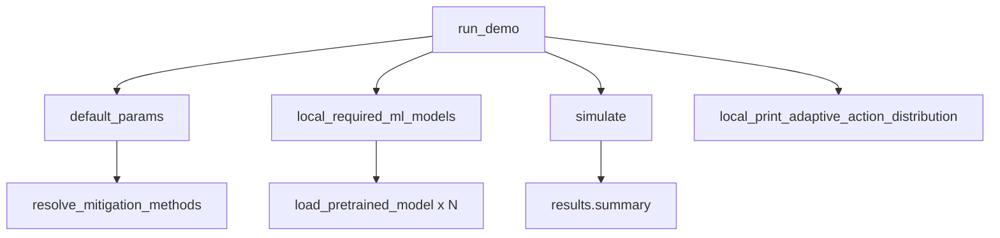
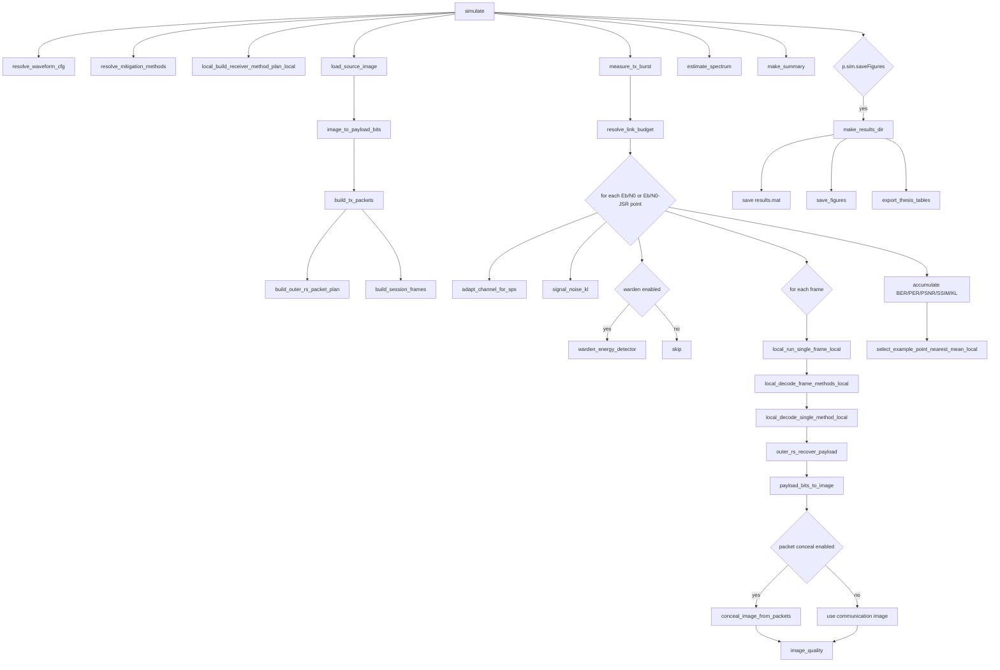
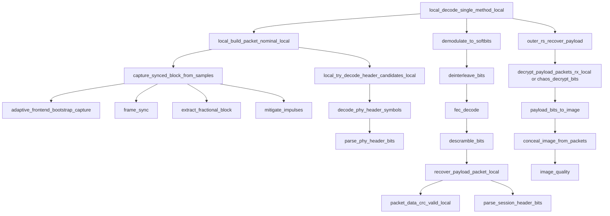
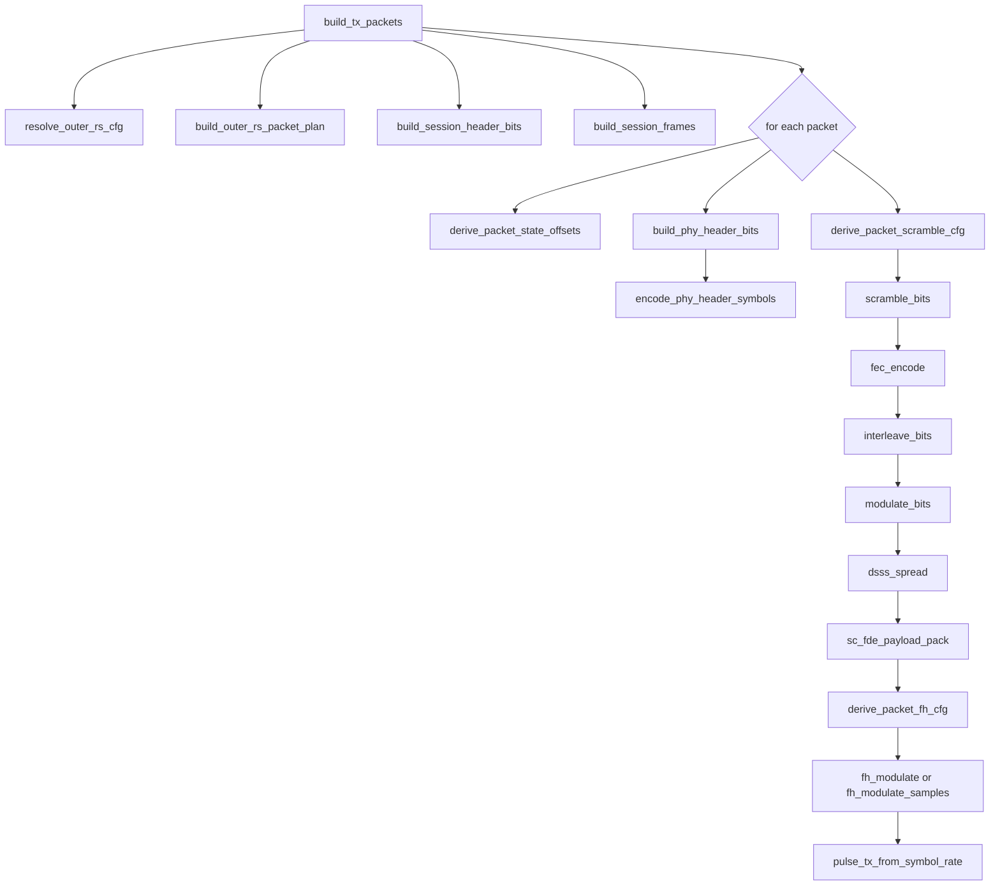
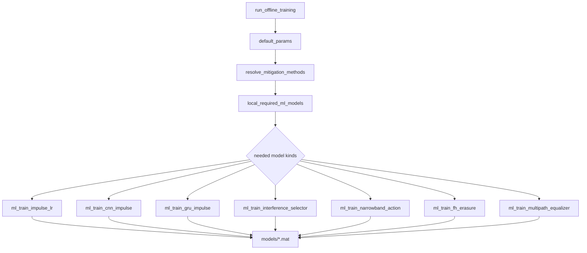

# Project-Specific Function Call Graph

Generated from current codebase on 2026-04-23.
Main references:
- `run_demo.m`
- `run_offline_training.m`
- `src/default_params.m`
- `src/simulate.m`
- TX/RX core modules under `src/tx`, `src/sync`, `src/coding`, `src/channel`, `src/mitigation`, `src/source`

## 1) Main Entry (run_demo)

## 2) End-to-End Simulation (simulate)

## 3) RX Per-Method Decode Chain (Core)

## 4) TX Packet Build Chain (Core)

## 5) Offline Training Chain

## 6) Quick Navigation Index (Most Important Files)

- Entrypoints:
  - `run_demo.m`
  - `run_offline_training.m`
- Global configuration:
  - `src/default_params.m`
- Main scheduler:
  - `src/simulate.m`
- TX build:
  - `src/tx/build_tx_packets.m`
  - `src/tx/build_session_frames.m`
- RX sync/equalization:
  - `src/sync/capture_synced_block_from_samples.m`
  - `src/sync/frame_sync.m`
  - `src/sync/multipath_equalizer_from_preamble.m`
- Coding/FEC/RS:
  - `src/coding/build_outer_rs_packet_plan.m`
  - `src/coding/outer_rs_recover_payload.m`
- Channel and mitigation:
  - `src/channel/adapt_channel_for_sps.m`
  - `src/channel/channel_bg_impulsive.m`
  - `src/mitigation/resolve_mitigation_methods.m`
  - `src/mitigation/mitigate_impulses.m`
- Image and recovery:
  - `src/source/image_to_payload_bits.m`
  - `src/source/payload_bits_to_image.m`
  - `src/recovery/conceal_image_from_packets.m`
- Output:
  - `src/analysis/make_summary.m`
  - `src/io/save_figures.m`
  - `src/io/export_thesis_tables.m`
